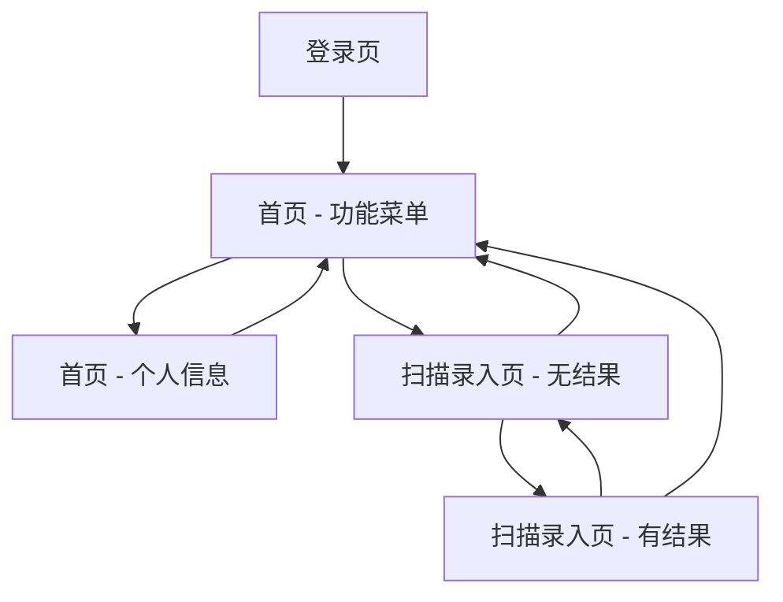

# uni-app 工业系统移动端简版设计说明

日期：2026-07-07

## 目标

使用 uni-app 设计并实现一个简易版工业系统移动端应用，优先面向 Android App，主要用户是一线操作员/巡检人员。

第一阶段先确认页面设计图，再进入实现。已确认采用低保真页面设计图，视觉方向为稳重蓝灰。

## 范围

包含：

- 登录页。
- 登录成功后进入首页。
- 首页包含底部两个页签：功能菜单、个人信息。
- 首页顶部为导航栏，仅显示标题，不显示返回按钮和退出按钮。
- 功能菜单页签只保留一个菜单：扫描录入。
- 功能菜单使用 3 列图标宫格，图标块为主，菜单名显示在图标块下方。
- 扫描录入页顶部为导航栏，左侧返回首页，不显示右侧按钮。
- 扫描录入页顶部内容区为扫描输入框，输入框右侧有扫码按钮。
- 扫描录入页底部固定显示清空按钮，占一整行。
- 扫描录入页支持手动输入、摄像头扫码、PDA 底层扫描事件。
- 扫描录入页下方显示扫描后的结果。
- 扫描无结果时，结果区域保持空白。

不包含：

- 具体设备台账、巡检、工单、异常上报等业务功能。
- 调用真实登录接口。
- 扫描结果查询设备详情接口。
- 复杂权限、消息、设置、离线同步。

## 页面设计

### 1. 登录页

页面元素：

- 应用 Logo 占位。
- 应用名称：工业移动端。
- 账号输入框。
- 密码输入框。
- 记住账号复选项。
- 本地模拟登录提示。
- 登录按钮。

交互：

- 使用账号和密码进行本地模拟登录。
- 登录成功后进入首页的功能菜单页签。
- 登录失败时用 toast 提示“账号或密码错误”。

### 2. 首页 - 功能菜单

页面结构：

- 顶部状态栏。
- 顶部导航栏：
  - 中间：标题“首页”。
  - 不显示返回按钮。
  - 不显示退出按钮。
- 内容区：3 列图标宫格。
- 底部页签：
  - 功能菜单。
  - 个人信息。

菜单：

- 第一版只有一个菜单：扫描录入。
- 菜单展示为图标块，下方显示“扫描录入”。
- 宫格按 3 列布局设计，后续增加菜单时自然换行。

交互：

- 点击“扫描录入”进入扫描录入页。
- 点击底部“个人信息”切换到个人信息页签。
- 个人信息页内的“退出登录”按钮触发退出登录。

### 3. 首页 - 个人信息

页面结构：

- 顶部状态栏。
- 顶部导航栏：
  - 中间：标题“个人信息”。
  - 不显示返回按钮。
  - 不显示退出按钮。
- 内容区：用户信息卡片。
- 底部页签：
  - 功能菜单。
  - 个人信息。

展示字段：

- 姓名。
- 工号。
- 班组/部门。
- 角色。
- 登录账号。
- 退出登录按钮。

数据：

- 第一版使用静态模拟用户数据。

### 4. 扫描录入页 - 无结果状态

页面结构：

- 顶部状态栏。
- 顶部导航栏：
  - 左侧：返回。
  - 中间：标题“扫描录入”。
  - 右侧：不显示按钮。
- 内容区顶部：扫描输入框。
  - 左侧输入区域：支持手动输入或显示扫描值。
  - 右侧按钮：扫码。
- 下方结果区域：无结果时保持空白。

交互：

- 点击返回回到首页。
- 点击扫码调用摄像头扫码。
- 用户可手动输入编码。
- 底部固定清空按钮清空输入框和结果。

### 5. 扫描录入页 - 有结果状态

页面结构：

- 扫描输入框显示当前扫描值。
- 下方结果区域显示扫描结果值。

结果展示：

- 第一版只显示扫描结果值。
- 页面内部可保留扫描来源状态用于调试和后续扩展，但正式页面不展示复杂业务字段。

## 扫描能力设计

第一版需要同时支持：

- 手动输入。
- uni-app 摄像头扫码。
- PDA 底层扫描事件。

PDA 扫描接入策略：

- 优先支持 Android 原生插件或广播监听，面向斑马 PDA DataWedge / Intent Broadcast 场景。
- 同时支持键盘输入模拟兜底，处理扫描枪将结果当作文本输入的场景。
- 页面层不直接依赖具体厂商 API，而是接收统一的扫描结果事件。

统一扫描结果模型：

```ts
type ScanSource = 'manual' | 'camera' | 'pda-broadcast' | 'keyboard';

interface ScanResult {
  value: string;
  source: ScanSource;
  raw?: unknown;
  scannedAt: number;
}
```

页面处理规则：

- 任意来源得到扫描值后，统一写入输入框。
- 同步更新扫描结果展示区。
- 清空时同时清空输入框和结果。
- 多次扫描时以最近一次结果为准。

## 导航与状态

页面关系：



状态：

- 登录状态：第一版使用本地模拟状态。
- 用户信息：第一版使用静态模拟数据。
- 扫描结果：保存在扫描录入页状态中。

## 设计图确认版本

已确认低保真页面设计图 v3：

- 文件：`.superpowers/brainstorm/32648-1783402817/content/wireframes-v3.html`
- 本地视觉页：`http://localhost:54134`

## 实现约束

- 技术栈：uni-app。
- 目标端：Android App 优先。
- UI 风格：稳重蓝灰。
- 首页页签位置：底部。
- 功能菜单布局：3 列宫格。
- 扫描页无结果时不显示空状态文案。
- 不实现任何具体业务功能，只实现扫描录入入口和结果展示。

## 验收标准

- 能看到登录页。
- 本地模拟登录成功后进入首页。
- 首页底部可切换“功能菜单”和“个人信息”两个页签。
- 功能菜单页显示一个 3 列宫格样式的“扫描录入”入口。
- 点击扫描录入进入扫描录入页。
- 扫描录入页顶部有扫描输入框和扫码按钮。
- 手动输入后可展示扫描结果。
- 摄像头扫码成功后可展示扫描结果。
- PDA 广播扫描和键盘输入模拟扫描通过统一适配层进入页面。
- 清空按钮可清空输入框和结果。
- 退出登录返回登录页。
